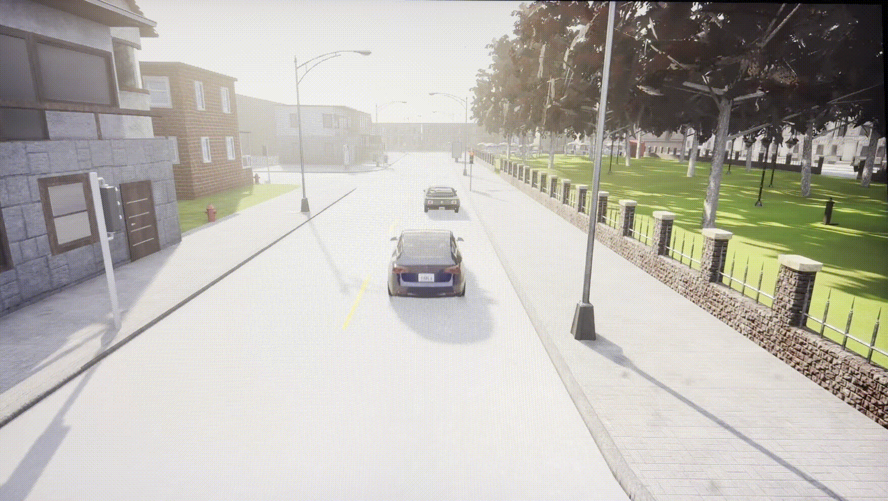

# Carla-Simulator

Autonomous driving experiments in **CARLA** using RL (PPO), with room for MPC/PID-style control. The aim is stable end-to-end driving behavior in simulation.

> Main code is located in **`carla_ppo/WindowsNoEditor/`**

---

## Stack

| Piece | Choice |
|--------|--------|
| Simulator | [CARLA](https://carla.org/) |
| RL | [Stable-Baselines3](https://stable-baselines3.readthedocs.io/) PPO |
| Python API | `carla` client + Gym-style env wrapper |

---

## Setup

1. Install and run a CARLA release that matches your client API version.
2. Create the Python environment:

```bash
cd carla_ppo
conda env create -f environment.yml
conda activate rl-driving
```

Or with pip: `pip install -r requirements.txt` (see comments in that file for GPU PyTorch).

3. Training scripts live under **`carla_ppo/WindowsNoEditor/`** (`carla_env.py`, `train_ppo.py`).

---

## Training Versions

### V1 — Lane Keeping (PPO)

| Aspect | Detail |
|--------|--------|
| **Task** | Lane keeping **without** brake control in the action space. |
| **Actions** | `Box(low=[0, -1], high=[1, 1])` — `[throttle, steer]` |
| **Timesteps** | 100k environment steps, PPO from Stable-Baselines3 |
| **Reward** | `0.3 * velocity - 0.3 * lateral_norm`, plus **-50** on collision; extra shaping for smooth steering (penalty on sharp steer) |
| **Note** | One RL decision step = one CARLA control step (no frame-skip between action and sim step) |

**Challenge:** I trained 3 models to achieve the final result, all using PPO. However, the model only performs well in simple tasks like lane keeping. Once more NPC vehicles are added to the environment, using PPO policy's action directly to apply control is too challenging — especially when trying to map `action[0]` to both throttle and brake simultaneously. The reward function of moving forward vs. braking when an NPC is ahead seems contradictory. Even though steer sharp penalty & action repeat methods work well for smoothness, the vehicle still struggles to apply good brake control. This led to the next stage: **ACC + PPO for steering**, aligning more closely with real autonomous driving planning.



**Setup:** Town02, **0 NPC** vehicles, simple observations + custom reward, full RL PPO.

**Outcome:** Smooth steering and **lane following** in CARLA; policy learns throttle/steer coordination without explicit brake dimension.

#### Demo

[V1 lane following in CARLA — YouTube](https://www.youtube.com/watch?v=ElbHdQus8k0)


---

### V2 — ACC + PPO for Steering

> *Still tuning. Facing challenges with throttle and brake control.*

#### Failures & Lessons Learned

1. **Single LiDAR Channel** — Channel=1 is too weak to detect actors in the front 30° cone. Set back to default for better performance.

2. **Town02 is too small** — Contains many left turns, which easily lowers `lidar_distance` and triggers false braking.

3. **ACC oversensitive at low speed** — Bad design of clip range:
   ```python
   denom = max(d_safe + 5.0 - self.acc_d_min, 1e-3)
   ratio = (d_lead - self.acc_d_min) / denom
   v_target = self.acc_v_set * float(np.clip(ratio, 0.0, 1.0))
   ```
   At high speed, `v_target` only changes slightly with distance. At low speed, `v_target` changes by 2 m/s when `lidar_distance` changes by 1m. This leads to even worse ACC behavior:
   ```python
   speed_err = v_target - v_ego
   if speed_err > 0:
       throttle = ...
       brake = 0.0
   else:
       throttle = 0.0
       brake = ...
   ```
   As soon as `v_target > v_ego`, brake immediately flips to throttle — very confusing for the model when `v_ego` is low with an oversensitive `lidar_distance`.

4. **ACC controls forward, policy only gets steering reward** — Terrible cold start. Only `lane_keeping` and `yaw_heading` provide gradient.

5. **Low-speed steer penalty** teaches the model not to steer when the car is stopped by oversensitive LiDAR — a local minimum trap.

6. **Action repeat at 50ms is too coarse** — At full speed (~15 m/s), the car moves 2m between consecutive control applications, making it almost impossible to turn at high speed.

#### Planned Fixes

- [x] Use `speed * cos_h` to reward both speed and heading direction jointly
- [x] Add `lateral_acceleration` to observation (a parked car on the side of the lane still gives nonzero lateral error, but `a_y=0`)
- [x] Replace raw LiDAR with **semantic LiDAR** (`sensor.lidar.ray_cast_semantic`) to filter by semantic tag (14=Car, 15=Truck, 16=Bus) — only vehicles trigger ACC braking
- [ ] Investigate optimal action repeat hyperparameter based on vehicle speed

#### Training Note

Model converges quicker on lane following compared to V1:
```python
forward  = 0.5 * speed_norm * cos_h
lane_keep = (1.0 - abs(lateral_norm)) * 0.4
```

The model is satisfied with driving forward along the path direction — even on the right lane, it already gets reward and can run for a while as long as no building or NPC comes from the other side. Model can already drive straight at 20K–30K global steps, which is faster than V1.

<span style="color:gray">*5.20 — Back from finals.*</span>

**New observations:**
- Action repeat is beneficial in most cases, but my `time.sleep(0.05)` means 2m/s without control at full speed, making turning at high speed extremely hard.
- Model got stuck in a local minimum due to **lack of off-road / wrong-way observations** — from the model's perspective, the penalty looked like a "black box" with no causal signal.
- I believe action repeat in CARLA has an optimal methodology dependent on vehicle speed, but the hyperparameter should differ from other RL approaches.


### V3 — Remove Action Repeat + Synchronous Mode

> This is the **most impactful architectural change** across all versions.

#### The Problem: Asynchronous Mode (V1–V2)

In earlier versions, the CARLA server and the Python client ran on **independent clocks**:

```
CARLA Server (runs freely):
  tick_0 ──→ tick_1 ──→ tick_2 ──→ tick_3 ──→ tick_4 ──→ ...
  (delta_seconds varies: 8ms ~ 35ms, depends on rendering load)

Python Client (runs freely):
  apply_control()      time.sleep(0.05)     _update_state()
       │                     │                     │
       └── action applied  ──┘ blind wait ──────→ reads state
           to which tick?      how many ticks     from which tick?
           unknown             happened?          mixed / stale?
```

**Three critical failures of async mode:**

| Problem | Consequence |
|---------|-------------|
| **Uncertain physics step size** | Each tick advances a variable amount of time (8–35ms). The same action might apply for 2 ticks or 5 ticks — RL credit assignment is broken. |
| **Sensor timing is not guaranteed** | LiDAR callback, camera callback, and collision callback arrive at unpredictable times. You might read `speed` from tick_4 but `lidar_distance` from tick_2 — the observation is **mixed-timestep garbage**. |
| **Action repeat = blind faith** | `time.sleep(0.05)` assumes 50ms passed, but the server may have advanced anywhere from 0 to 100+ ms. The RL algorithm cannot learn a causal relationship between action and outcome. |

**In short:** This is like driving with your eyes closed, only opening them once every 5 seconds, and operating the steering wheel during that blind interval — you have no idea what happened in between.

#### The Fix: Synchronous Mode + `world.tick()`

Three lines of configuration flip the entire control paradigm:

```python
settings = self.world.get_settings()
settings.synchronous_mode = True        # Server waits for client
settings.fixed_delta_seconds = 0.05     # Exactly 50ms per tick
self.world.apply_settings(settings)
self.tm.set_synchronous_mode(True)      # NPCs also wait
```

**What this guarantees:**

```
One RL step = exactly one world.tick() = exactly 50ms of physics

apply_control(a_t)          ← Action queued for next tick
      │
world.tick() ──────┐
      │            │  Server advances physics by exactly 0.05s
      │            │  • a_t takes effect (steer, throttle, brake)
      │            │  • Vehicle position/velocity updated
      │            │  • LiDAR completes one full 360° scan (20 Hz)
      │            │  • All sensor callbacks triggered & completed
      │            │
tick() returns ←──┘       ← Synchronization barrier: everything is fresh
      │
_update_state()            ← Reads speed, position, lidar_distance — all from the SAME tick
      │
_get_observation()         ← Builds obs — every value is causally consistent
```

**Key design decisions that make this work:**

| Component | Value | Why |
|-----------|-------|-----|
| `fixed_delta_seconds` | 0.05s (50ms) | One RL step = one physics step. No action repeat needed — credit assignment is exact. |
| LiDAR `rotation_frequency` | 20 Hz | 1/0.05 = 20 Hz — one full scan per tick. LiDAR data and physics are perfectly aligned. |
| LiDAR `points_per_second` | 600,000 | 600k ÷ 20 = 30k points per frame. Dense enough for reliable vehicle detection in the 60° front cone. |
| RL decision frequency | 20 Hz | 1 tick per step. The model sees every single frame — no information is lost to frame skipping. |

**Why no more action repeat:**  
With `fixed_delta_seconds = 0.05`, each `world.tick()` advances exactly one 50ms step. There is no "blind gap" between steps — every tick is a new observation and a new action. The RL algorithm sees the full trajectory at 20 Hz, which is the same decision frequency as the CARLA server's physics loop. Credit assignment is no longer blurred across an unknown number of sub-steps.

**What this fixed from V2:**
- Off-road / wrong-way states added to observation — the model can now **see** it's being penalized, closing the causality loop.
- ACC deadband + low-pass filter eliminates throttle/brake oscillation.
- `time.sleep(0.05)` replaced with `world.tick()` — no more wasted time, no more timing uncertainty.

#### Result

- Small-scale experiments succeeded: **300K steps** achieve lane following.
- Still weak at 90° turns (Town02's typical intersection geometry).
- Final model saved: `models/stage_acc_hybrid_v4_20260520_040630_final.zip`
- **Mission accomplished:** ACC brake control + PPO steering is working. Moving to Town03 for robustness testing.

#### Demo

[V3 ACC+PPO for Steering — YouTube](https://www.youtube.com/watch?v=XdELDMxeIsc)


---

#### Next Steps

- [ ] Increase `lane_keep_coef` from 0.5 → 0.8
- [ ] Train on larger, more varied maps (Town03, Town05)
- [ ] Read: *Neuro-Cognitive Reward Modeling for Human-Centered Autonomous Vehicle Control* (CVPR 2026)
- [ ] Read: *AEGIS: Human Attention-based Explainable Guidance for Intelligent Vehicle Systems* (CHI 2025)
- [ ] Investigate: If only using RL, the vehicle optimizes for reward, not for human-like driving. How do we model "driving style"?

---

## License

See [`LICENSE`](LICENSE) in the repository root.